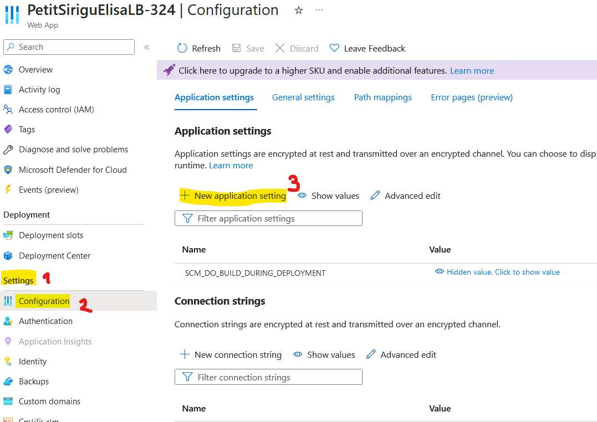
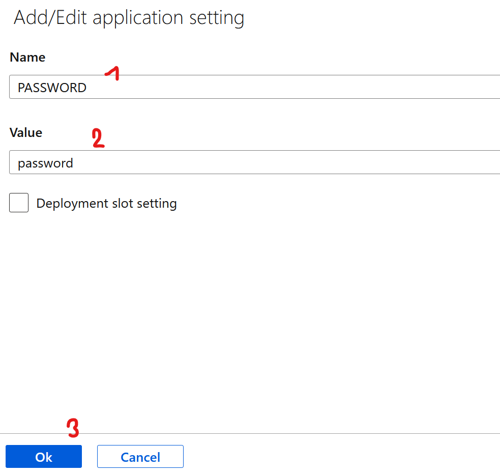

# LB 324

## Aufgabe 2
Erklären Sie hier, wie man `pre-commit` installiert.

## Pre-commit installieren

Man kann `pre-commit` auf zwei unterschiedliche Wege installieren:

Als erstes müssen Sie sicherstellen, dass Sie Pip haben. Falls nicht können Sie es unter folgendem Link herunterladen:
https://pip.pypa.io/en/stable/installation/

### Erste Möglichkeit
Als erstes müssen Sie VisualStudio Code öffnen (Entwicklungsumgebung). Danach müssen Sie ein neues Terminal öffnen und folgender Befehl eingeben:
`pip intall -r requirements.txt`

- Vergessen Sie nicht ihr `pre-commit-confic` file in den requrements zu ergänzen! Dafür müssen Sie pre-commit hineinschreiben. 

### Zweite Möglichkeit
Nun müssen Sie die Konsole öffnen, indem Sie die Windowstaste drücken und danach cmd in das Suchfeld eingeben. Klicken Sie dann Enter. 
Als nächstes müssen Sie in Ihr Projekt, indem Sie die pre-commis installieren wollen navigieren: cd <<Pfad/zum/Projekt>>
Als letztes müssen Sie VisualStudio Code öffnen (Entwicklungsumgebung). Danach müssen Sie ein neues Terminal öffnen und folgender Befehl eingeben:
`pip intall -r requirements.txt`

## Aufgabe 4
Erklären Sie hier, wie Sie das Passwort aus Ihrer lokalen `.env` auf Azure übertragen.

Als erstes muss man sich auf Azure anmelden. Danch müssen Sie eine `Web app` erstellen. 
Wenn das alles gemacht ist müssen Sie auf ihre `Web app` klicken und folgende Schritte ausführen:

`Einstelungen` -> `Konfiguration` -> Ein neues Fenster öffnet sich -> `Neue Anwendungseinstellung`

Geben Sie folgendes ein und klicken Sie dann auf `speichern` in der oberen Leiste.

